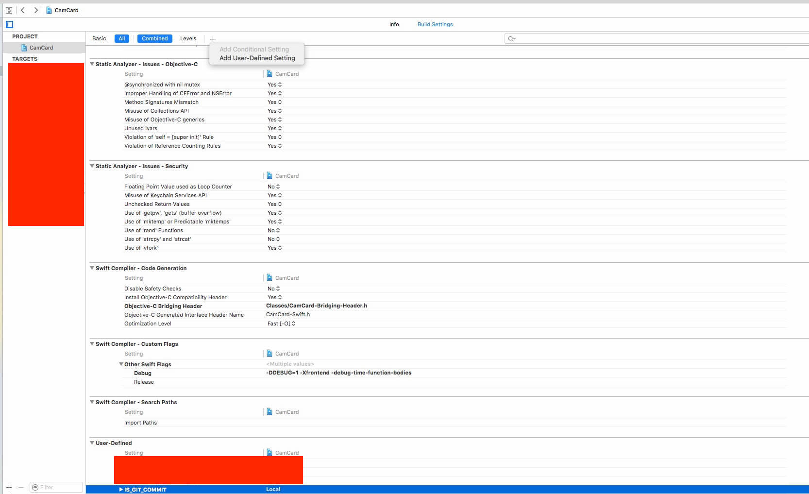
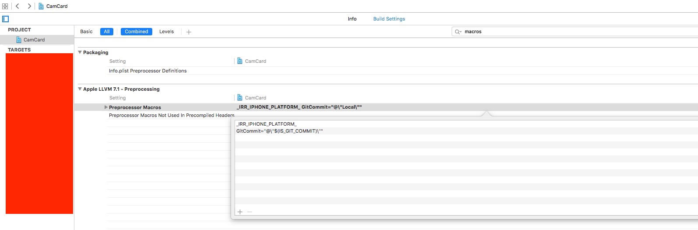

最近公司的项目都切到了Git上，之前在使用SVN的时候，BuildServer在编译版本的时候会自动将SVN版本号同时打到编译出来的包中，这样我们在提交测试或者提交到ITC的时候可以由开发的同学们再Double Check一遍版本号，保证提交的版本不会有问题。但是Git上是不存在SVN版本号这样一个东西的，那么我们该如何追踪呢，下面介绍一下我想到的一个办法：

在项目配置中选中PROJECT（不是某一个Target，如果选中的是某一个Target的话，需要给为所有Target都操作一遍），点击Build Settings选项，添加User-Defined Setting，将Key设置为：`IS_GIT_COMMIT`，Value本地随便填。具体操作如下图：


在Build Settings搜索macros，在Preprocessor Macros中添加一项：
`GitCommit="@\"$(IS_GIT_COMMIT)\""`


在项目中就可以正常使用GitCommit这个宏了:

```
NSString *gitCommit = GitCommit;
NSLog(@"%@", gitCommit);
```
